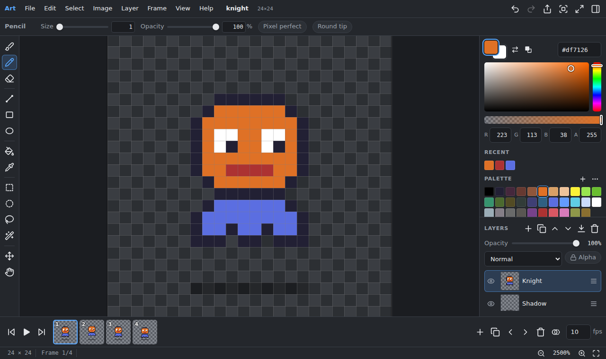
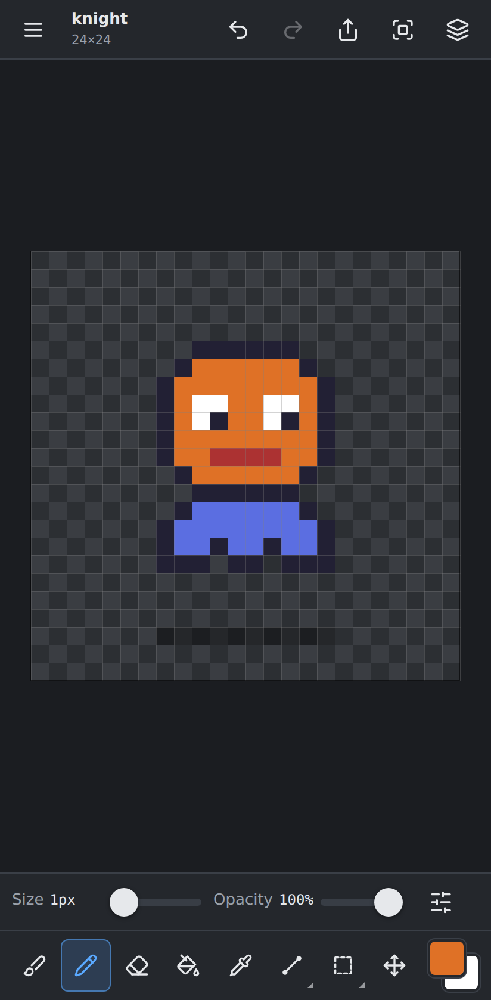
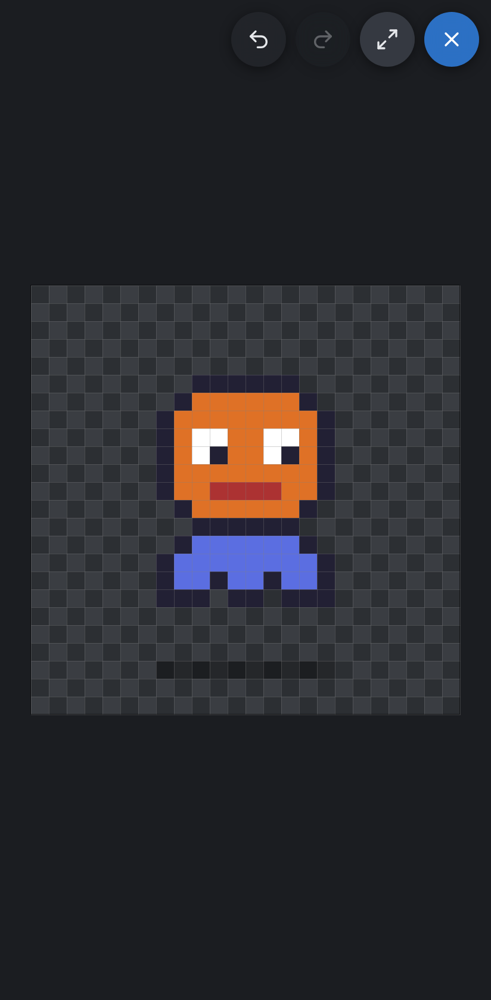

# Art

**A free, open-source raster and sprite editor for desktop and mobile browsers.**
Draw, erase, use layers and frames, and export transparent PNGs. It works
offline, needs no account, and runs on a PC, tablet or phone with mouse,
finger or stylus.



<p>
  
  &nbsp;
  
</p>

## Why

Art is made for creating and editing **game sprites and 2D game art**. It takes
the useful core of editors like GIMP, Krita and Aseprite and keeps it small,
fast and canvas-first.

- **100% free and open source** (MIT). No ads, no subscriptions, no "premium" brushes, no watermarks, no blocked exports.
- **No account, no cloud, no tracking.** Your images never leave your device unless you export or share them.
- **Works offline** once it has been opened (installable as an app).
- **The same app everywhere:** a compact editor on desktop, a full-screen drawing app on phones.

## Features

**Drawing**
- Brush with size, opacity, hardness, smoothing (stabilizer) and pen pressure (size and/or opacity)
- Pencil with hard pixel edges, square or round tip, and *pixel-perfect* mode for clean 1px lines
- Eraser (hard-pixel or soft) that erases to true transparency
- Line (Shift snaps to pixel-art angles 1:1, 2:1, 1:2), rectangle and ellipse (outline/filled, optional anti-aliasing)
- Fill bucket with tolerance, contiguous/global, and "sample all layers"
- Gradient tool (Shift+G): linear or radial, foreground → background or → transparent, optional ordered dithering for the classic pixel-art look
- Shading tool (K): each stroke moves pixels one step along the palette (right-click: the other way), each pixel at most once per stroke
- Color picker (Alt+click in paint tools), right mouse button paints with the background color
- Text tool (T): a built-in crisp 5×7 pixel font (scalable 1×–8×) or system fonts with or without anti-aliasing; text lands as a floating selection (on its own layer if you like) to move or transform
- Shift+click draws a straight line from the last stroke
- Symmetry: mirror brush, pencil and eraser strokes left ↔ right, top ↔ bottom or both, around a movable axis (Alt+X, Alt+Y)
- Uniform stroke opacity: overlapping dabs inside one stroke never get darker

**Selection & transform**
- Rectangle, ellipse and lasso selection; magic wand. Replace/add/subtract/intersect (Shift/Alt)
- Select by color, feather selection, grow, shrink and border selections (round or square, any radius); Ctrl+Alt+= / Ctrl+Alt+- grow or shrink by 1px. Select layer content → 1px outside border → fill outlines a sprite
- Move tool with floating selections: drag or nudge with arrow keys without destroying what is underneath, then apply or cancel
- Free transform (Shift+T): scale with 8 handles (Shift keeps proportions), rotate with the round handle (Shift snaps to 15°), flip, rotate 90°, crisp nearest-neighbour or smooth resampling
- Cut, copy, copy merged, paste (as a floating selection or a new layer), including images from the system clipboard
- Crop to selection, trim transparent edges, canvas size with anchor, scale image (nearest neighbour or smooth), flip and rotate

**Layers**
- Add, duplicate, delete, rename, reorder (drag or buttons), merge down, flatten
- Visibility, opacity, blend modes (normal, multiply, screen, additive), alpha lock
- Layer groups (Ctrl+G): fold, hide and fade a whole group, move layers in and out with the up/down buttons, merge or ungroup
- Live thumbnails

**Sprites & pixel art**
- Crisp nearest-neighbour zoom, pixel grid when zoomed in, configurable tile grid, snap to grid
- Exact pixel coordinates and selection size in the status bar
- Frames with onion skin and animation playback (FPS)
- Linked cels: a linked frame (Alt+L) shares pixels with the frame it came from, so a held pose or background is drawn once
- Animation tags ("walk", "idle"…): shown above the frames, loop while playing inside them (forward, reverse or ping-pong), export one tag as GIF/APNG/sheet; sheet JSON includes Aseprite-style `frameTags`
- Export animations as looping GIF or lossless APNG (with per-frame timing)
- Tile preview (Alt+T): the image repeats around itself and drawing wraps across the edges, for seamless tiles and textures
- Replace color (Shift+R) on one layer or all layers and frames, with tolerance; color → transparent works too
- Sprite sheet import (slice by cell size, offset and gap) and export (strip or grid, with padding and frame-data JSON)
- Export scaled up 2×–16× without blurring
- Palette lock: every painted color (including brush blending and gradients) snaps to the palette; Map colors to palette (with optional dithering) converts existing art
- Palettes: a palette browser with built-in console and artist palettes (Game Boy, Game Boy Pocket, GBA-style and SNES-style 15-bit palettes, NES, PICO-8, Commodore 64, DawnBringer 16/32, Endesga 32, Sweetie 16, grayscale, 1-bit) and **your own palettes**: create, rename, edit colors, add/remove, reorder, sort, round to 15-bit, duplicate, delete. Switch quickly from the palette name in the color panel. Import GIMP `.gpl`, `.hex`/`.txt` and JASC `.pal` (saved to your palettes); export `.gpl` and `.hex`; extract colors from a layer
- Map colors to palette converts an image to the selected palette — by default onto copies of the layers, keeping the originals (hidden) underneath

**Color**
- Foreground/background colors, HSV picker, hex and RGBA input, alpha, recent colors, palette swatches

**Files**
- Open PNG, JPEG, WebP, GIF and BMP; import images as layers; drag and drop
- Export PNG (lossless, exact alpha), JPEG and WebP (where the browser supports it)
- Projects are saved automatically in the browser and restored when you come back
- **Recent projects** shows animated thumbnails for multi-frame sprites (the tag around the current frame, with its timing), crisp and transparent; turn them off in Settings
- Save portable `.artproj` project files ([open format](docs/file-format.md)); on desktop Chrome/Edge, Save writes back to the same file
- Share exports directly to other apps on mobile
- Timelapse: every project records small snapshots as you draw (kept in the browser with the project, across sessions); File → Export timelapse… makes an MP4/WebM video, GIF or APNG of any length

**Touch, stylus & views**
- Pen: draws with pressure; pen eraser end erases. Palm rejection while the pen is down
- Finger: one finger draws, two fingers pan and pinch-zoom (optional rotation), two-finger tap = undo, three-finger tap = redo
- Once a pen is detected, fingers switch to navigation (configurable in Settings)
- QuickShape: stop at the end of a stroke and hold — it becomes a straight line (drag to adjust the end) or, if the stroke closes, an ellipse
- Touch and hold with a paint tool to pick a color, with a magnifier loupe above your finger
- Size and opacity sliders on the edge of the canvas on tablets (left or right, in Settings)
- Reference image window (Alt+R): move, resize, pan and zoom it; tap it to pick exact colors
- Zoom, pan, fit, 100%, rotate and mirror the view
- **Canvas only** mode (Tab, or the focus button in the top bar): everything but the canvas disappears; exit with ✕, Tab or the back gesture
- **Fullscreen** (where the browser allows it)

## Using Art

Open the app, pick a size (or open an image) and draw.

| | Desktop | Touch |
| --- | --- | --- |
| Draw | Left mouse button | One finger or pen |
| Pan | Space+drag, middle mouse, Hand tool | Two fingers |
| Zoom | Mouse wheel, Ctrl+wheel, `+`/`-`, pinch on a trackpad | Pinch |
| Undo / redo | Ctrl+Z / Ctrl+Shift+Z | Two-finger tap / three-finger tap, ↶ ↷ buttons |
| Tool options | Options bar under the menu | Slider strip above the tools; tap the active tool for all options |

Common shortcuts: **B** brush, **P** pencil, **E** eraser, **L** line, **U**
rectangle, **O** ellipse, **G** fill, **I** picker, **K** shading, **Shift+G** gradient, **T** text, **S** select, **Q** lasso,
**W** magic wand, **M**/**V** move, **H** hand, **X** swap colors, **D** default
colors, **[ ]** brush size, **Ctrl+S** save, **Ctrl+O** open, **Ctrl+E**
export, **Ctrl+Shift+S** save project file, **Tab** canvas only, **F** fullscreen.
The full list is under **Help → Keyboard shortcuts & gestures**. On macOS use ⌘
instead of Ctrl.

### Where is my work saved?

- **Automatically in your browser** (IndexedDB), a moment after every change.
  Reopening Art restores the last project; **File → Recent projects** lists all of them.
- **As a file** with **File → Save project as file** (`.artproj`). Use this
  for backups and to move work between devices. Browser storage can be
  cleared by the browser or the user.
- **Exported images** (PNG/JPEG/WebP) via **File → Export image**.
- **Timelapse snapshots** are kept in the browser next to each project and
  deleted with it (turn recording off with **File → Record timelapse**).

### Install as an app

Art is a Progressive Web App. In Chrome/Edge use *Install app* in the address
bar or menu; on Android choose *Add to Home screen*; on iPhone/iPad open the
Share menu in Safari and choose *Add to Home Screen*. The installed app opens
full screen, works offline, and on desktop Chrome/Edge can open `.artproj` and
image files directly.

## Supported browsers and devices

| Platform | Browser | Notes |
| --- | --- | --- |
| Windows, macOS, Linux | Chrome / Edge 92+ | Best support: native open/save dialogs, file handling when installed |
| Windows, macOS, Linux | Firefox 113+ | Files are saved as downloads |
| macOS | Safari 16.4+ | WebP export not available (Safari cannot encode WebP) |
| Android phones & tablets | Chrome | Pen pressure (e.g. S Pen) supported |
| iPhone & iPad | Safari 16.4+ | Apple Pencil pressure supported; iPhone has no fullscreen API — install to the Home Screen for a full-screen app |
| Touchscreen Windows devices | Chrome / Edge | Pen, touch and mouse all work |

## Development

Requirements: Node.js 20+.

```sh
npm install
npm run dev          # start the dev server at http://localhost:5173
npm run build        # type-check and build the static site into dist/
npm run preview      # serve the production build
npm test             # unit tests (Vitest)
npm run test:e2e     # end-to-end tests in Chromium (Playwright)
```

The end-to-end tests drive the real app: drawing, layers, undo, export (the
exported PNG is decoded and checked pixel by pixel), saving and reloading, mobile
touch and multi-touch gestures, pen pressure and offline use. Run
`npx playwright install chromium` once before the first run.

Icons are generated with `npm run icons` (`scripts/generate-icons.mjs`).

### Deploying

`npm run build` produces a fully static site in `dist/` that can be hosted
anywhere (GitHub Pages, Netlify, any web server, even a subfolder). The
repository includes a GitHub Actions workflow (`.github/workflows/pages.yml`)
that builds the app and pushes it to the `gh-pages` branch on every push to
`main` (or manually): enable it once under **Settings → Pages → Source: Deploy
from a branch → `gh-pages` / (root)**. Another workflow
(`ci.yml`) runs the type check, unit tests, build and end-to-end tests on every
push and pull request.

## Architecture

Art is plain TypeScript with no runtime dependencies, bundled by Vite. UI
components are small classes that build DOM directly and subscribe to events,
so drawing never triggers UI re-rendering.

```
src/
  core/        Document model and pixel engine (no DOM)
    surface.ts     RGBA pixel buffer (+ lazily created display canvas)
    layer.ts       Layer = properties + one cel (surface) per frame
    document.ts    Size, layers, frames, active layer/frame, selection, events
    paint.ts       PaintSession: coverage mask → pixels (strokes, shapes, fills)
    tiles.ts       Tile recorder and swap-based undo patches
    history.ts     Undo/redo stack with step and memory limits
    selection.ts   Mask-based selection (any shape)
    composite.ts   Exact compositing and blend modes (export, merge, sampling)
    raster.ts      Bresenham, ellipses, polygons, flood fill
    imageops.ts    Crop, flip, rotate, resize
    palette.ts     Presets and palette file formats
  render/      Viewport (zoom/pan/rotate/flip) and the canvas renderer
  input/       Pointer handling: mouse, pen, touch, gestures, wheel
  tools/       One class per tool, with declarative option specs
  io/          PNG codec, image import/export, project format, IndexedDB, files
  ui/          Panels, menus, dialogs, tool bar, options bar, timeline
  editor.ts    Application state and operations used by the UI
  ops.ts       Undoable document operations (layers, frames, image, selection)
  actions.ts   Commands shared by menus, the mobile menu and keyboard shortcuts
  app.ts       Responsive shell, layout, canvas-only/fullscreen, clipboard
  app-files.ts Autosave, open/import, save, export
  pwa/         Service worker template (precache list generated at build time)
```

Key design decisions:

- **Exact pixels.** Layers store straight (non-premultiplied) RGBA bytes.
  Canvases are used only for display, because the browser's canvas
  premultiplies alpha and would alter semi-transparent colors. PNG files are
  encoded and decoded by Art itself (using the browser's built-in zlib
  streams), so a sprite exported from Art has exactly the pixels you drew.
  Images with up to 256 colors are written as compact indexed PNGs.
- **One paint engine.** Brushes, pencil, eraser, shapes and fill write
  *coverage* into a mask; pixels are recomputed from the original tile data.
  This gives uniform stroke opacity, live shape previews, selection clipping
  and alpha lock in one place.
- **Cheap undo.** Edits record only the 64×64 tiles they touched; undo and redo
  swap the same buffers, so history memory is proportional to what changed,
  with step and memory caps.
- **Fast display.** Layers are composited into a cached canvas and only dirty
  rectangles are recomposited. Zooming, panning and rotating redraw a single
  image. Rendering runs at most once per animation frame.
- **Frames from the start.** Every layer holds one cel per frame, so animation
  features grow without changing the document model.

## Project file format

`.artproj` files are plain JSON with one PNG per layer and frame, documented in
[docs/file-format.md](docs/file-format.md). They are easy to read from game
tools or scripts.

## Contributing

Bug reports, ideas and pull requests are welcome. See
[CONTRIBUTING.md](CONTRIBUTING.md) for setup, checks and the project's ground
rules (no ads, tracking or paywalls; no dead buttons; exact pixels).

## Roadmap

Next steps being considered: more blend modes and moving PNG encoding to a
worker for very large images.

## License

Art is released under the [MIT License](LICENSE). It is a short, permissive
license: you can use, modify and redistribute Art (including for commercial
work). Images you create with Art are entirely yours. Third-party notices are in
[THIRD_PARTY_NOTICES.md](THIRD_PARTY_NOTICES.md).
